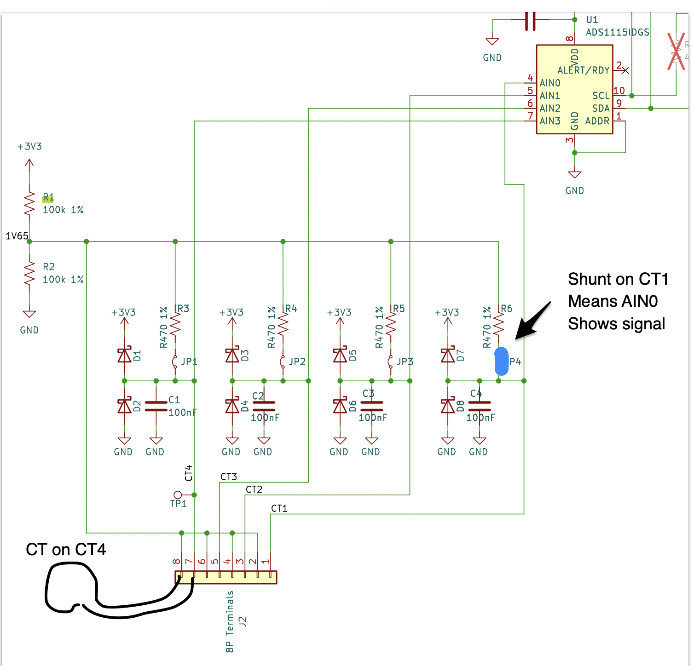
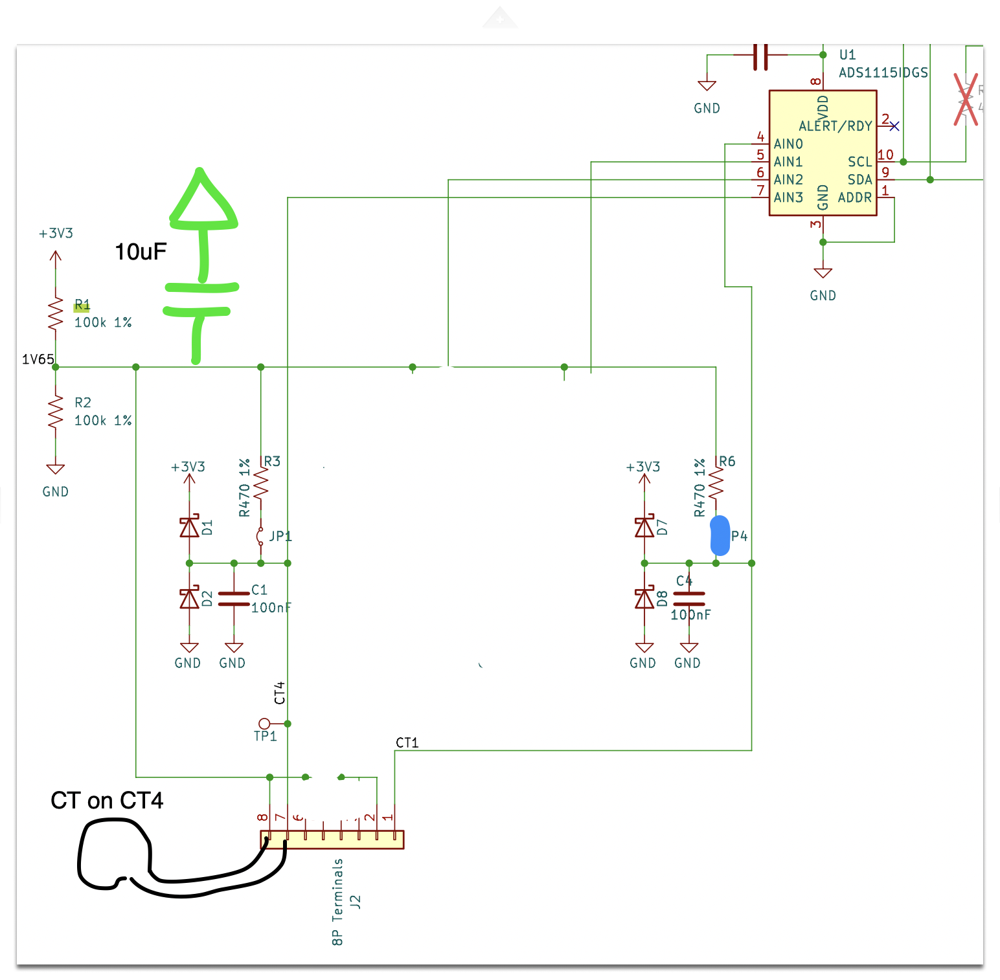

# gw108-ct-testing, 2026-09-07 → 2026-09-10

Status: Accepted · Pass 1 · Updated 2026-09-10

> What this is: a gw108 CT input with nothing on it reads the CT on a
> neighbouring input

## Setup

**The board.** The gw108 RevB CT sheet
(`gridworks-hardware/PCBs/KiCad/FullScada1/Gw108_RevB/ADC.kicad_sch`, the
copper in `Gw108_RevB.kicad_pcb`). Four CT inputs on one ADS1115 (U1 at
0x48, read single-ended against ground): connector CT1 → P0, CT2 → P1,
CT3 → P2, CT4 → P3. Only two matter here, CT4/P3 (where the CT was) and
CT1/P0 (where the signal showed up).

Each CT connector has two terminals. The odd one goes to the input node
(the ADC pin), the even one goes to a node the sheet calls `1V65`. The
input node has a 100 nF capacitor to ground, two Schottky clamps, and a
two-pin header that, with a shunt fitted, puts 470 Ω between the input
node and `1V65`. Only the CT1 header carries a shunt on the spruce
board.

`1V65` is the midpoint of two 100 kΩ resistors, R1 up to 3.3 V and R2
down to ground. **Nothing else holds it: no capacitor is on that net.**
The four 10 µF parts on the sheet are on the thermistor ADC's inputs.
All four CT return terminals and all four 470 Ω burdens land on `1V65`.

The CT's two leads are on J2 pins 7 and 8. Pin 7 is the P3 input node,
pin 8 is `1V65`. The blue shunt on JP4 is the only shunt on the board,
so P0 is the one input with a 470 Ω path (R6) to `1V65`; JP1, JP2 and
JP3 are open.

**The run (run 3, 2026-09-09, spruce).** One CT on the board: a
voltage-output CT (an eGauge 1 A type, burden built into the CT) with
its two leads on the CT4 terminals, clamped on the secondary pump's
conductor. Nothing on CT1, CT2 or CT3. `peek.py`, from the laptop,
stopped the deployed scada and the summer hack, held the iso valve
open, ran the secondary pump alone on the 0x21 relays for 15 s, and
captured P3 and then P0 for two seconds each with the box's
`capture.py` (ADS1115 single-shot at 860 SPS, 394 conversions/s
effective); then restored relays and services. The two instances are in
`instances/`, folded on the fitted mains frequency by `fold.py`.

## Found

| input | on it | bias V | waveform rms mV | noise rms mV | fold Hz |
| --- | --- | --- | --- | --- | --- |
| P3 | the CT | 1.642 | 85.1 | 6.5 | 60.008 |
| P0 | nothing | 1.642 | 79.8 | 6.2 | 60.010 |

P0, with nothing attached, carries 94 % of the CT's signal, at the same
bias. It is not pickup and not a solder bridge; it is the circuit
working as drawn.

**What happens**

1. The CT is a small floating AC source, about 90 mV, between its two
   leads. Lead one is on the P3 node, lead two is on `1V65`. It sets the
   *difference* between those two nodes and says nothing about where
   either sits relative to ground.
2. The ADC reads each input against ground, so what matters is how each
   of the two nodes is tied to ground. The P3 node: its 100 nF, which at
   60 Hz has an impedance of about 26 kΩ (1 / 2π·60·100 nF). The `1V65`
   node: R1 and R2 in parallel, 50 kΩ, plus the path through CT1's shunt,
   470 Ω, to the P0 node and its 100 nF to ground, about 27 kΩ; together
   about 23 kΩ.
3. Two similar impedances in series across a 90 mV source: the voltage
   splits about evenly. The P3 node goes up by about half the signal
   while the `1V65` node goes down by about half, sixty times a second.
   **The `1V65` node wobbles at 60 Hz by nearly as much as the input the
   CT is on.**
4. P0 is connected to `1V65` through 470 Ω into an ADC pin that draws
   essentially nothing, so P0 is a voltmeter on `1V65`. It reports the
   wobble: the 80 mV.
5. P1 and P2 did not read it because their headers have no shunt, so
   there is no path from `1V65` to them at all. They float at whatever
   their diode leakage sets and read nothing.

The same thing happens with any CT. A current-output CT on the shunted input drives its current through the 470 Ω, and the resulting voltage splits the same way: the reading is about half the burden voltage and the other half is on `1V65`.

Joe reproduced it in CircuitLab: the midpoint wobbles with the circuit as drawn, and adding a 10 µF capacitor on it solves it.

## The fix

**A 10 µF capacitor from `1V65` to ground.** 

The capacitor sits between `1V65` and ground, across R2; nothing else on
the sheet changes.

At 60 Hz, 10 µF is about 265 Ω, a hundred times stiffer than the 23 to 50 kΩ holding `1V65` today.  A 10 µF ceramic loses some capacitance under its 1.65 V DC bias, perhaps to 6–8 µF; that is still about sixty times stiffer, which is plenty to hold `1V65V` steady enough.  Once `1V65` node is steady, each  CT's whole voltage has to appear on the input node where the ADC reads it.

## Timeline

- 2026-09-09 afternoon ET, spruce: run 3 as above (George on site,
  Jessica running the script).
- 2026-09-09: the schematic and copper traced; `1V65` has no
  capacitor; all four inputs wired alike.
- 2026-09-10: Joe's CircuitLab reproduction; this folder cut down to
  the one run and the explanation.

## Folder contents & experimental method

The two instances were GENERATED by this experiment's own harness on
the spruce box (the ADS1115 read directly, the deployed scada and the
summer hack stopped for the window and restarted after); they are in no
store, and a re-run makes a new dataset. Nothing here came from the
journal DB or the eventstore.

- `instances/hw1.isone.me.versant.keene.spruce.ta-p3.sec.run3-gw.adc.waveform-000.json`
  — P3 with the CT, secondary pump alone. `gw.adc.waveform` instance,
  788 conversions over 2 s.
- `instances/hw1.isone.me.versant.keene.spruce.ta-p0.sec.run3-gw.adc.waveform-000.json`
  — P0 with nothing attached, same phase.
- `capture.py` — runs on the box: one burst of ADS1115 conversions on
  one input, written as a `gw.adc.waveform` instance.
- `peek.py` — runs on the laptop: the stop / relays / capture /
  restore sequence that produced the run, with `--channels P3,P0`.
- `fold.py` — runs on the laptop: the fold, the numbers above, and a
  `-fold.png` beside each instance (generated, gitignored).
- `ct_before.png` — page 17 of `GW108_RevB_SCH_D1100.pdf` (the CT
  sheet) annotated with the run 3 arrangement; hand-made, committed for
  the README.
- `ct_after.png` — the same sheet, CT4 and CT1 only, with the 10 µF
  drawn in; hand-made, committed for the README.
- `GW108_RevB_SCH_D1100.pdf` — the RevB schematic, all sheets. EXTERNAL
  EVIDENCE, the ordered board's drawing.
- `speed-ladder/` — a side question with its own README: the CT signal
  against the secondary pump's drive level, six levels on one pass,
  with the waveform and ladder figures.

Regenerate a new run (the box's `~/experiments` at a pushed SHA, the CT
arrangement as above; about a minute, the deployed scada stopped and
restarted by the script):

    uv run python peek.py --run <tag> --channels P3,P0

Re-fold the committed evidence:

    uv run python fold.py instances/hw1.isone.me.versant.keene.spruce.ta-p3.sec.run3-gw.adc.waveform-000.json
    uv run python fold.py instances/hw1.isone.me.versant.keene.spruce.ta-p0.sec.run3-gw.adc.waveform-000.json
