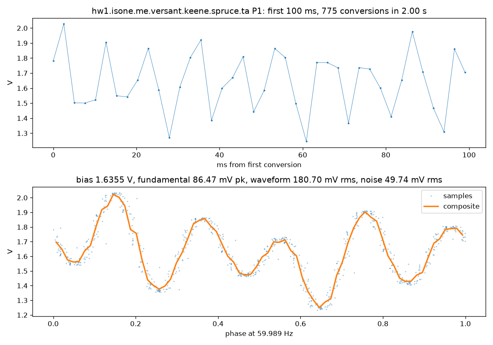
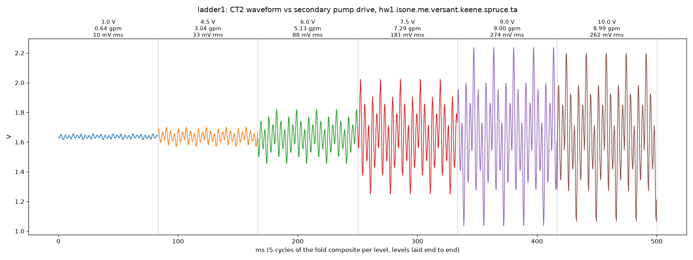

# speed-ladder, 2026-09-07

Status: Accepted · Pass 1 · Updated 2026-09-10

> What this is: how well the CT signal can detect changing power levels on a pump where we can vary the speed.

The question: how well can a  CT on the gw108 detect the whole speed band, not just on against off, for a controllable pump. This goes beyond the on/off requirement, so this evaluates nice-to-have performance.

## Setup

Spruce, 2026-09-07, 13:05 to 13:12 ET. The eGauge voltage-output CT on
the CT2 connector (P1), clamped on the secondary pump's conductor, the
0x21 relay driving the pump. `ladder.py` ran on the box from the
starter-scripts venv with the summer hack stopped for the window: pump
relay on, then for each of six DAC levels (3.0, 4.5, 6.0, 7.5, 9.0,
10.0 V, the pump's speed band per the 2026-09-06 sweep: linear 3.5 to
8.5 V, maximum from 9 V) a 60 s hold, the freshest `secondary-flow`
from the scada snapshot recorded for the label, and a two-second P1
burst via `capture.py`. DAC back to the hack's 7.55 V and the relay to
its entry bit at the end; hack restarted. Every level got a pico flow
reading within its hold.

The board state was the one the parent README explains: `1V65`
undecoupled, CT1's header shunted, CT2's not. So each reading here is
the CT's voltage split across the input node and the `1V65` node, not
the full CT output; the shape and the ratios between levels are the
result, the absolute scale is not.

## Found

| DAC V | secondary-flow gpm | waveform rms mV | fundamental pk mV | noise rms mV |
| --- | --- | --- | --- | --- |
| 3.0 | 0.64 | 10.0 | 3.4 | 3.4 |
| 4.5 | 3.04 | 32.5 | 11.3 | 11.2 |
| 6.0 | 5.13 | 87.5 | 37.3 | 23.3 |
| 7.5 | 7.29 | 180.7 | 86.5 | 49.7 |
| 9.0 | 9.00 | 274.0 | 152.8 | 47.6 |
| 10.0 | 8.99 | 261.7 | 152.8 | 100.1 |

- The CT tracks the pump. Waveform rms rises about 27-fold from
  minimum speed to maximum while flow rises 14-fold, the shape of pump
  power growing faster than flow. 9 V and 10 V give the same flow and
  the same current, matching the sweep's finding that the pump is at
  maximum from 9 V.
- The flows agree with the 2026-09-06 sweep curve at every level, so
  the label is trustworthy.
- The fold locks at every level, down to 10 mV rms at minimum speed
  with 3.4 mV of noise about the composite. One pass through the CT
  resolves the pump across its whole range.
- The waveform is not a sine. From 4.5 V up it has five peaks per
  cycle, an ECM circulator's drive current, and only grows in amplitude
  from there; the 60 Hz fundamental is about half the rms. That is why
  the fold's composite rms, not the fundamental, is the number to read.

**One level, 7.5 V (the hack's running speed).** Top: the first 100 ms
of raw conversions. Bottom: every conversion placed by phase on one
period of the fitted 59.989 Hz, the composite over the samples. 180.7 mV
rms on a 1.636 V bias, 49.7 mV of noise about the composite.

**The ladder.** Five cycles of each level's composite laid end to end in
rising DAC order, each segment labelled with drive, flow and rms.

## Analysis notes

- The y axis is the input's volts on its bias, not current; the
  absolute scale is open (a clamp-meter reading against one level would
  set it), and the parent finding means every value here is roughly
  half the CT's actual output. After the `1V65` fix the levels should
  about double and keep their ratios.
- `noise rms` is the scatter of the samples about the composite; the
  jump at 10 V (100 mV) is the pump at its limit, not the ADC.

## Timeline

- 2026-09-07 13:04 ET: summer hack stopped.
- 13:05 to 13:12: `ladder1`, six levels, 60 s each.
- 13:13: DAC and relay restored, hack restarted; instances and the
  levels file collected, the box's copies removed.

## Folder contents & experimental method

The six instances were GENERATED by `ladder.py` on the spruce box (the
ADS1115 read directly, the summer hack stopped for the window and
restarted after); they are in no store, and a re-run makes a new
dataset. The flow labels came from the scada's own snapshot on the box.

- `instances/hw1.isone.me.versant.keene.spruce.ta-p1.dac<volts x 10>.ladder1-gw.adc.waveform-000.json`
  — the six bursts on P1, `dac030` is 3.0 V, `dac100` is 10.0 V.
- `ladder1-levels.json` — the level table: DAC volts and code, pico flow
  with its age, instance name. GENERATED by `ladder.py`; it carries the
  label because `gw.adc.waveform` has no field for the drive level or
  the flow (the CT component vocabulary retires this sidecar).
- `ladder.py` — the driver, runs on the box (starter-scripts venv for
  the DAC and relay, the scada venv for `capture.py`).
- `staircase.py` — the ladder figure, runs on the laptop; uses the
  parent folder's `fold.py`.
- `ladder1-staircase.png`, `ladder1-dac075-waveform.png` — the two
  figures above, committed so the README can embed them.

Regenerate a new ladder (the box's `~/experiments` at a pushed SHA):

    # on spruce
    sudo systemctl stop spruce-summer-hack.service
    cd ~/experiments/2026-09-07-gw108-ct-testing/speed-ladder
    ~/starter-scripts/venv/bin/python ladder.py --run <tag>
    sudo systemctl start spruce-summer-hack.service
    # on the laptop, then remove the box's copies
    scp 'spruce:~/experiments/2026-09-07-gw108-ct-testing/speed-ladder/instances/*<tag>*' instances/
    scp spruce:~/experiments/2026-09-07-gw108-ct-testing/speed-ladder/<tag>-levels.json .

Regenerate the figures from the committed instances (from this folder):

    uv run python staircase.py --run ladder1
    uv run python ../fold.py instances/hw1.isone.me.versant.keene.spruce.ta-p1.dac075.ladder1-gw.adc.waveform-000.json
    cp instances/hw1.isone.me.versant.keene.spruce.ta-p1.dac075.ladder1-gw.adc.waveform-000-fold.png ladder1-dac075-waveform.png
