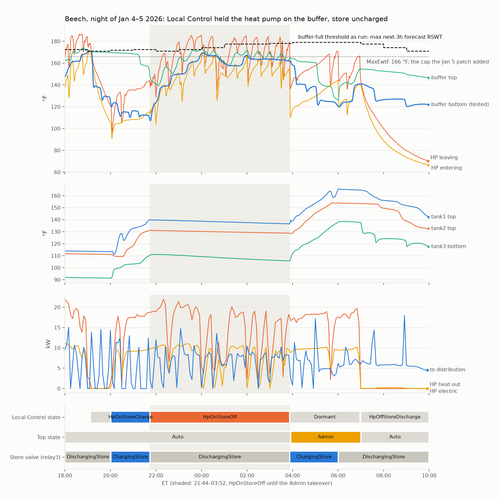
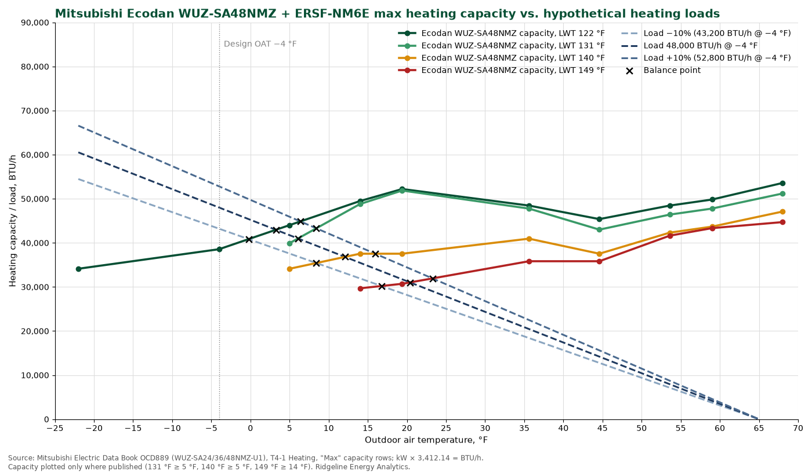

# beech-missing-store-heat-analysis, 2026-01-04/05

Status: Draft · Pass 0 · Updated 2026-10-08

> What this is: why beech's store did not charge on the coldest night of
> the 2025–26 season (2026-01-04 21:44 to 2026-01-05 03:52 ET) while the
> heat pump was on, and the patches and designs that follow.
> Observational, from the journal DB. The logbook entry is the index
> record.

## Why

January 5 was the coldest day of the season at beech, and 02:00–04:00
its coldest hours. By 07:00 the store was much less full than on other
mornings. The heat pump had been on all night, but no hot water had gone
into the store from about 22:00 to 04:00. The question: why did the
store not charge, and where did the heat pump's energy go? What hangs
on it: the design day is the case local control has to survive, and
three more houses arrive this fall.

## Found

**Why did the store not charge?** Local Control's buffer-full test
could not pass on a design day, so it held the heat pump on the buffer
for six hours. Thomas put in a partial patch that morning (timeline
item 6): it caps the test at the heat pump's `MaxEwtF` (a constant set
by hand in `.env`), which would have released the store about four
hours earlier. It does not cover the case where the heat pump cannot
reach `MaxEwtF` either; that is
[OPS-577](https://linear.app/gridworks/issue/OPS-577) under Follow-up work.

**The decisive fact had to be guessed.** The test that held the heat
pump on the buffer compares a buffer temperature with the required
supply water temperature (RSWT) *as the code derives it*. Neither that
derived RSWT nor the test's result is in the persistent store, and
neither is the commit beech was running. The rule was read from
`d9f5f857`, chosen from `dev` history and commit times as the last
commit before the fix, and the forecast RSWT it would have used was
replayed from `heating.forecast`. The data is consistent with that
reading (no transition all night) but cannot confirm it. Two gaps:
the running commit, closed by OPS-7 (the scada announces it at boot
since `2b01bb46`), and the RSWT as used, still open under OPS-223.

## Timeline

Times are ET.

1. Beech was running Local Control (called HomeAlone at the time; its
   state machine reports as `ha.winter.state`), not its LTN. For all of
   Jan 3–6 the LTN raised an hourly Error glitch, `Error in
   read_forecasted_price_for_now: .../atn/price_forecast.csv does not
   have a price forecast for this hour`, 96 in four days.
2. At 21:44 Local Control went from `HpOnStoreCharge` to `HpOnStoreOff`
   because the buffer read empty: `buffer-depth1` at 144 °F against a
   threshold of about 151 °F (the next three hours' forecast RSWT minus
   ΔT). In `HpOnStoreOff` the heat pump heats the buffer only and the
   store valve (relay3) stays on discharge.
3. The only exit from `HpOnStoreOff` is "buffer full". In the code
   before 2026-01-05 that meant `buffer-depth3` above the highest
   forecast RSWT of the next three hours, with no cap. The forecast
   asked for 171–179 °F all night (`heating.forecast`).
4. The buffer bottom peaked at 169.8 °F (00:09). The heat pump was
   at its ceiling: 170.0 °F entering, 189 °F leaving. The threshold was
   never reached, so Local Control held the heat pump on the buffer for six
   hours.
5. At 03:52 an Admin takeover set relay3 to `ChargingStore` and the
   store charged: tank1 top went from 137 to 165 °F by 06:00.
6. Two commits to `gridworks-scada` `dev` on 2026-01-05 (`6beb94cf` at
   04:21 ET, `5cad202f` at 04:43 ET) cap both buffer thresholds at
   `MaxEwtF` (166 °F at beech, per `layout.lite`). Replayed over this
   night, the capped rule reads the buffer full from 23:56, about four
   hours before the takeover.
7. Through the coldest hours the heat pump cycled. Between 00:00 and
   03:07 it went off six times, 5 to 10 minutes each, about 53 minutes
   in all (`hp-odu-pwr` under 1 kW). Five of the six stops came with
   leaving water at 187–189 °F and entering water at 163–167 °F, which
   looks like the heat pump's own high limit; the 00:54 stop (leaving
   157 °F) is unexplained. Held on a 165–170 °F buffer, it had nowhere
   cooler to send its heat. Charging the store, at 110–137 °F, would
   have kept entering water low and the heat pump running. After the
   03:52 takeover, charging the store, it ran without a real stop until
   06:58 at about 18 kW of heat out (chart, third panel).

## Analysis notes

### What the data shows and what only the code says

| Fact | Source |
|---|---|
| States: `HpOnStoreOff` 21:44–03:52, relay3 on discharge, Admin 03:52–06:59 | data: `report.event` StateList |
| `MaxEwtF` 166, strategy House0Sieg | data: `layout.lite` Ha1Params (boots 2026-01-02 and 2026-01-05) |
| Forecast RSWT, next three hours: 171–179 °F | data: `heating.forecast` |
| Buffer bottom max 169.8 °F; heat pump entering max 170.0 °F | data: readings |
| The full test as it ran: `buffer-depth3` against uncapped forecast RSWT | **code only, from a guessed commit.** Read from `d9f5f857`, the last `dev` commit before the fix; the commit beech was running is not in the data, the RSWT the code derived and tested against is not in the data, and the scada's "Buffer full / not full" log lines are not in the persistent store. It agrees with the data (no transition). |
| The capped rule would have read full from 23:56 | inferred, by replaying the rule over the readings |

### How much more heat without the cycling?

The heat pump ran 5.1 of the 6 hours from 22:00 to 04:00. At its running rate
that night (about 16 kW), the 0.9 hours off cost about 15 kWh, 17% more
than it delivered. After the takeover, charging the cooler store, it
ran steadily at about 18 kW; at that rate for all six hours it would
have put out about 107 kWh, 24% more. Both figures are measured heat
pump output (primary flow × (LWT − EWT)), which at beech consistently
exceeds the heat measured into distribution; uninsulated pipes are the
suspected cause.

The estimate leans on how the LG behaves: it puts out almost the same
heat whatever the leaving water temperature (16 kW at 170–189 °F that
night, 18 kW charging the store at 130–155 °F). A monoblock does not;
its output falls as the water gets hotter. So at beech, time off is
heat lost, nearly one for one.

## Follow-up work

Each item names its Linear issue, or says there is none.

- **Local Control: exit `HpOnStoreOff` when the heat pump is at its
  limit** ([OPS-577](https://linear.app/gridworks/issue/OPS-577), a scada design, Backlog). The `MaxEwtF` cap
  ([OPS-186](https://linear.app/gridworks/issue/OPS-186), the January patch, Done) holds only while `MaxEwtF`
  sits below what the heat pump can reach that night. The exit fires on
  a high-limit trip, on the buffer no longer gaining, or after a
  maximum time, and moves to charging the store. Local control works
  until the design day; this is the case it has to survive.
- **The scada reports its code commit to the persistent store.** Here
  the code that ran had to be guessed from `dev` history and commit
  times. [OPS-7](https://linear.app/gridworks/issue/OPS-7)
  scada-commit-on-boot (Done 2026-10-08): the scada announces its full
  commit hash once per run at boot as the sema word `gw.scada.commit`
  (`gridworks-scada` `2b01bb46`, verified on the dev broker).
  JournalKeeper journals it with `layout.lite` 013 under
  [OPS-392](https://linear.app/gridworks/issue/OPS-392).
- **The scada reports the RSWT it actually used.** `heating.forecast`
  carries the hourly forecast series, but not the near-term value the
  scada derives from it (the max of the next three hours) and tests
  against, nor which channel each test read and the result. The scada
  logs these locally; they never leave the box. [OPS-223](https://linear.app/gridworks/issue/OPS-223) "Clarify
  and expose SCADA's required SWT derivations" (Backlog) proposes the
  near-term RSWT as derived channels; the rest of the decision trace is
  in no issue.

- **A more useful heat pump capability model.**  Capture the relationship
between max lwt, max thermal output, and outdoor temp. The LG units put out 
almost the same heat whatever the leaving water temperature, and was able
to put out 189 deg water on the coldest day in Maine, so it doesn't need this.
Monoblocs will be a different story.   [OPS-228](https://linear.app/gridworks/issue/OPS-228) "Model heat pump
capacity vs outdoor and leaving water temperature (LC and LA)" (Todo).
The Mitsubishi Ecodan, for example, loses capacity as leaving water
temperature rises, and its 149 °F capacity is published only from 14 °F
outdoors up:

- **A clear demonstration of how RSWT is modelled.** How the forecast
  RSWT is derived needs a demonstration the team can check against the
  houses. [OPS-223](https://linear.app/gridworks/issue/OPS-223) exposes the derivation and [OPS-315](https://linear.app/gridworks/issue/OPS-315) "RSWT
  issues" (Backlog) collects the model questions; neither is the
  demonstration.
- **Backup when the heat pump cannot meet the required water
  temperature (heating system design).** On the design day beech's
  emitters asked for 171–179 °F. The heat pump reached 189 °F leaving,
  which is remarkable, but in this night's configuration it could not
  hold it and tripped off (finding 7). A house whose design-day RSWT is
  at or near what its heat pump can deliver needs a backup that can
  meet it. Questions:
  - Can electric backup get high enough to help?
  - Do we want to be able to run the heat pump AND the backup together?

Note: beech was on Local Control because its LTN had no price forecast
from Jan 3 to Jan 6, an hourly Error glitch throughout ([OPS-486](https://linear.app/gridworks/issue/OPS-486),
Backlog). A standing price forecast is already in hand under
[OPS-437](https://linear.app/gridworks/issue/OPS-437) stand-up-price-forecast.

## Folder contents & experimental method

Observational: nothing was run on the house. All data comes from the
immutable store (the journal DB), as beech reported it: readings, the
state machines in `report.event`, the scada's hourly `heating.forecast`,
and the `layout.lite` it sends at boot, which carries its `Ha1Params`.
Nothing was generated by this analysis. Re-pullable by anyone with
`GJK_DB_URL` in `../.env`. The control logic was read from
`gridworks-scada` git history (`d9f5f857`, the last `dev` commit before
the fix).

- `instances/hw1.isone.me.versant.keene.beech.ta-gw.readings-000.json.gz`
  — the `gw.readings` instance, 38 channels, 2026-01-04 18:00 to
  2026-01-05 10:00 ET, gzipped (5.3 MB raw).
- `evidence/beech.scada-report.event.jsonl.gz` — the 192 untouched
  `report.event` payloads for the night (state machines and readings).
- `evidence/beech.scada-heating.forecast.jsonl.gz` — the 16 hourly
  `heating.forecast` payloads.
- `evidence/beech.scada-layout.lite.jsonl.gz` — the five `layout.lite`
  payloads from 2026-01-02 to 2026-01-05 14:00, carrying `Ha1Params`.
- `fetch_messages.py` — writes the three evidence files.
- `chart.py` — writes `beech-night-control-state.png` from the display
  CSV and the evidence files, decoded through the vendored sema snapshot
  at the versions beech sent (`report.event` 002, `heating.forecast`
  000, `layout.lite` 006); asserts `MaxEwtF` from `layout.lite`.
- `beech-night-control-state.png` — the chart above.
- `Ecodan_WUZ-SA48NMZ_Capacity_vs_Load.png` — copied from
  `heat-pumps/ecodan-hydrobox/`, built from Mitsubishi data book OCD889.

Regenerate everything from scratch:

    uv run python ../pull_readings.py --ta hw1.isone.me.versant.keene.beech.ta --start '2026-01-04 18:00' --end '2026-01-05 10:00' --out instances --channel hp-odu-pwr --channel hp-idu-pwr --channel hp-lwt --channel hp-ewt --channel primary-flow --channel primary-pump-pwr --channel store-flow --channel store-pump-pwr --channel store-hot-pipe --channel store-cold-pipe --channel buffer-hot-pipe --channel buffer-well --channel buffer-depth1 --channel buffer-depth2 --channel buffer-depth3 --channel tank1-depth1 --channel tank1-depth2 --channel tank1-depth3 --channel tank2-depth1 --channel tank2-depth2 --channel tank2-depth3 --channel tank3-depth1 --channel tank3-depth2 --channel tank3-depth3 --channel sieg-flow --channel sieg-cold --channel dist-swt --channel dist-rwt --channel dist-flow --channel dist-pump-pwr --channel oil-boiler-pwr --channel zone1-down-temp --channel zone1-down-set --channel zone2-up-temp --channel zone2-up-set --channel zone1-down-whitewire-pwr --channel zone2-up-whitewire-pwr --channel charge-discharge-relay3
    gzip -n instances/hw1.isone.me.versant.keene.beech.ta-gw.readings-000.json
    uv run python fetch_messages.py
    uv run python chart.py

Display CSV from the committed instance:

    gunzip -k instances/hw1.isone.me.versant.keene.beech.ta-gw.readings-000.json.gz
    uv run python ../pull_readings.py --display-from instances/hw1.isone.me.versant.keene.beech.ta-gw.readings-000.json

---

**From the instance to the display CSV.** The `*-gw.readings-000.json`
file is the canonical record: the channel words together with their
readings, validating against the sema registry. The `-display.csv`
sibling is presentation only — the same readings as natural-unit floats
(temperatures °F, flows gpm), converted per each channel word's own
encoding. Regenerate it any time, with no database or S3 access:

    uv run python ../pull_readings.py --display-from <instance>.json
